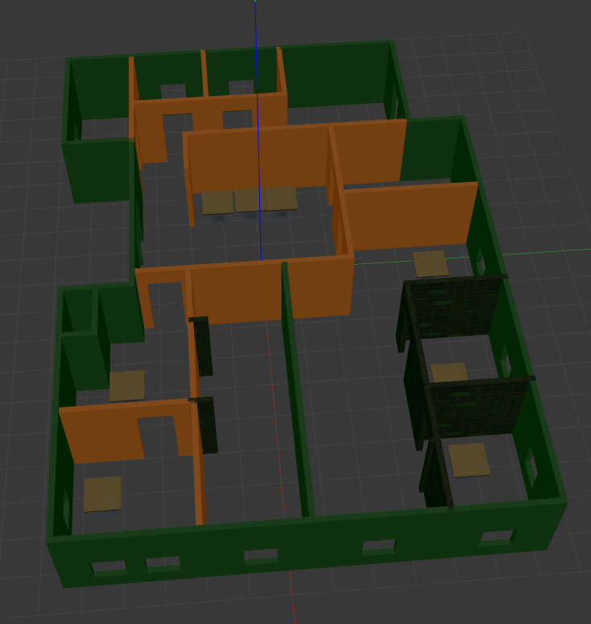
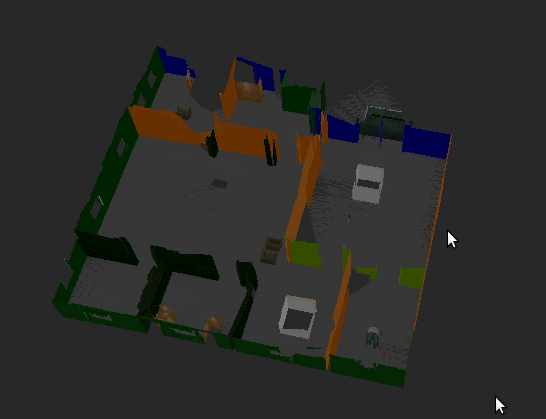
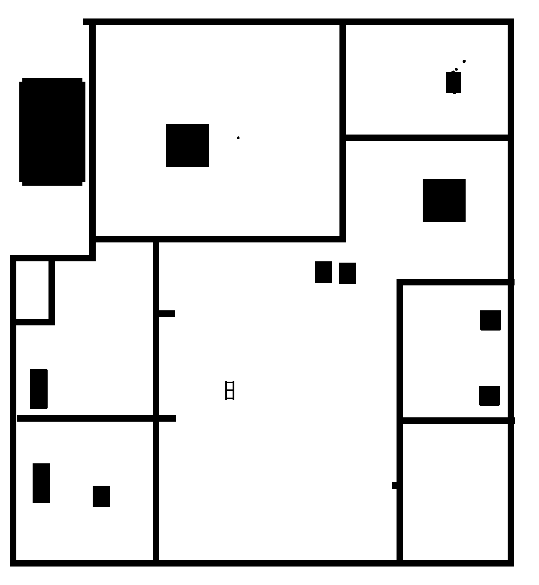
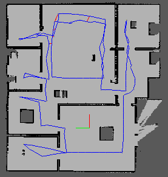

# Map My World

Udacity Robotics Software Engineer Nanodegree Program [Project 4]

An application of [rtabmap-ros](http://wiki.ros.org/rtabmap_ros) package for 
simultaneous localization and mapping (SLAM) of a mobile robot. 

<table style="width:100%">
  <tr>
    <th><p>
           </a>
           <br>3D Map
        </p>
    </th>
    <th><p>
           </a>
           <br>3D Mapping
      </p>
    </th>
  </tr>
  <tr>
    <th><p>
           </a>
           <br>2D Map
      </p>
    </th>
        <th><p>
           </a>
           <br>2D Mapping
      </p>
    </th>
  </tr>
</table>

## Description
The project consists of the following parts:
1. A Gazebo world and a mobile robot from this [project](https://github.com/kennydukor/Go-Chase-It).
2. ROS package: [rtabmap-ros](http://wiki.ros.org/rtabmap_ros)

## Prerequisites
1. ROS (Melodic or Kinetic), Gazebo on Linux
2. CMake & g++/gcc
3. Install `rtabmap-ros` package `$ sudo apt-get install ros-${ROS_DISTRO}-rtabmap-ros`

## Build and Launch

#### Clone project and initialize a catkin workspace

```
$ mkdir catkin_ws && cd catkin_ws
$ git clone https://github.com/kennydukor/Map-My-World.git
$ mv Map-My-World src
$ cd src && catkin_init_workspace
```

#### Within the `catkin_ws/src` folder, clone the `teleop` project

```
$ git clone https://github.com/ros-teleop/teleop_twist_keyboard
```

#### Move back to `catkin_ws\` and build

```
$ cd ..
$ catkin_make
```

#### Launch the world and robot

```
$ source devel/setup.bash
$ roslaunch kene_robot world.launch
```

#### Launch 'mapping.launch

Open another terminal (Ctrl+Shift+T), and launch the `mapping.launch` file. 
Here, the rtabmap-ros package will be launched.
```
$ source devel/setup.bash
$ roslaunch kene_robot mapping.launch
```

#### Launch Teleop

Open another terminal, and run the `teleop` node.

```
$ source devel/setup.bash
$ rosrun teleop_twist_keyboard teleop_twist_keyboard.py
```

#### Generate database

Click on this terminal, type keyboard to navigate the robot around. Navigate 
the robot to scan its surrounding environment. The rtabmap-ros package will save
the resulted map with the localized trajectory of the robot in a database file 
`~/.ros/rtabmap.db`.

Saved database: https://drive.google.com/file/d/10YTLmTXb2l-LAwcrFoA6_5SuDn9RNiOE/view?usp=sharing

#### Launch Database

Open another terminal, and open up the database file using `rtabmap-databaseViewer`

```
$ rtabmap-databaseViewer ~/.ros/rtabmap.db
```

* Choose View -> Constraints View and Graph View
* To see 3D Map, Choose Edit -> View 3D Map ...
